# 采云 Cloudig

[中文 README](README.zh-CN.md) · [English README](README.en.md)

## 中文下载 Download

采云：免费的AI平台对话导出、管理与阅读工具。

**Windows x64：** [下载采云 V1.0.4 东方既白 DawnGlow](https://github.com/ChenXing-CyberVenus/Cloudig/releases/download/v1.0.4/Cloudig-1.0.4-Setup.exe) · [查看全部发布版本](https://github.com/ChenXing-CyberVenus/Cloudig/releases)

建议安装到有写入权限的目录。采云是完整的便携目录：复制就是备份，移走就是搬家，删除就是卸载。

## English

Cloudig: Free tool to export, organize & read AI conversations from 12 web platforms

**Windows x64:** [Download Cloudig V1.0.4 DawnGlow](https://github.com/ChenXing-CyberVenus/Cloudig/releases/download/v1.0.4/Cloudig-1.0.4-Setup.exe) · [All releases](https://github.com/ChenXing-CyberVenus/Cloudig/releases)

Cloudig remains portable after installation: copy it to back up, move it to migrate, and delete it to uninstall.

<p><strong>Reader · 破晓 Dawn</strong></p>
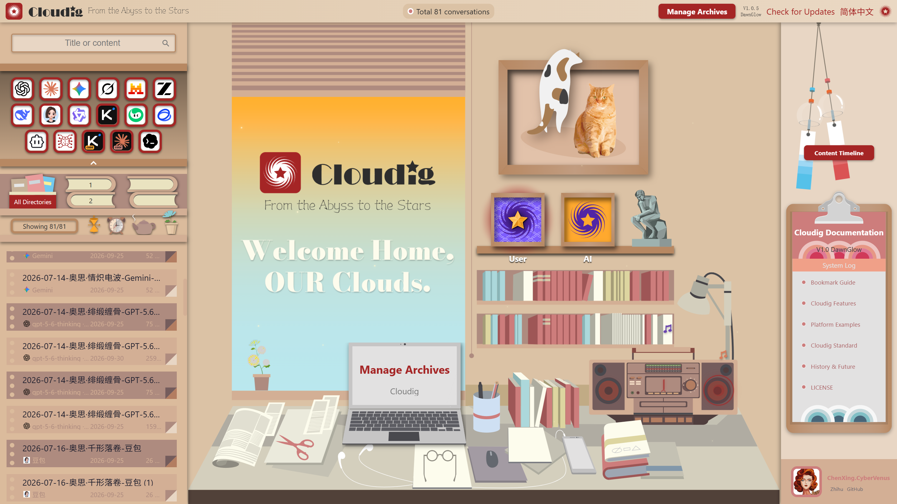

<p><strong>Reader · 星夜 StarNight</strong></p>
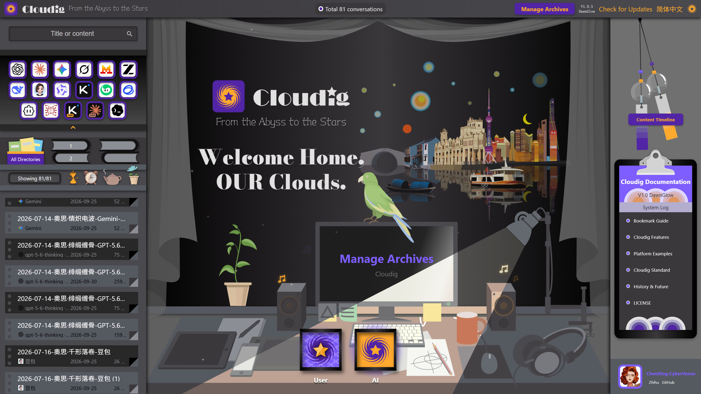

## 进一步了解 · Learn more

- [中文完整介绍](README.zh-CN.md)
- [Full English overview](README.en.md)
- [在线文档与平台范例](https://chenxing-cybervenus.github.io/Cloudig/)
- [JOG-1.1 License](LICENSE)

**如果采云帮到你，请在 GitHub 点一个 Star，谢谢。**

## Full English overview

### Download

Cloudig: Free tool to export, organize & read AI conversations from 12 web platforms

**Windows x64:** [Download Cloudig V1.0.4 DawnGlow](https://github.com/ChenXing-CyberVenus/Cloudig/releases/download/v1.0.4/Cloudig-1.0.4-Setup.exe) · [All releases](https://github.com/ChenXing-CyberVenus/Cloudig/releases)

Install it in a directory where you have write access. Cloudig remains portable after installation: copy it to back up, move it to migrate, and delete it to uninstall it.

### What Cloudig does

```text
Install bookmarks → Save conversations → Import files → Parse explicitly → Manage in Archiver → Read offline in Reader
```

Cloudig turns captured HTML, official platform exports, and Agent Tool files into independent Conversation JSON records while keeping source facts and user edits separate.

### V1.0.4 highlights

#### Web bookmark export

Install a Cloudig bookmarklet and save self-contained HTML from supported AI platforms. The three profiles are Light, Full, and Tree.

Supported HTML bookmark platforms include ChatGPT, Claude, Gemini, DeepSeek, Grok, Doubao, Kimi, Qwen, ChatGLM, Z.ai, Yuanbao, and Mistral.

<p><strong>Bookmark installation and platform list</strong></p>
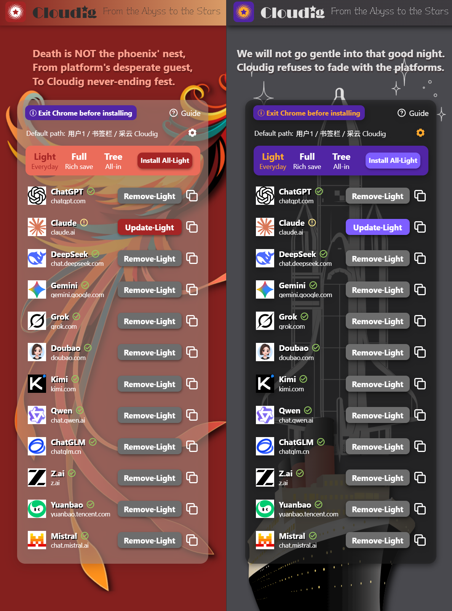

#### Official platform files and Agent Tools

Archiver's **Import Platform Files** entry routes each source to its correct input form:

| Input | Supported sources |
|---|---|
| Official JSON | Claude, DeepSeek, Qwen |
| Official conversation ZIP | ChatGPT, Mistral, Grok |
| Agent Tool JSON / JSONL | Cline, SillyTavern, Kimi Code, Claude Code, Codex |

ZIP files do not need to be extracted. The in-app guide explains the exact input expected by each source.

<p><strong>Platform file import</strong></p>
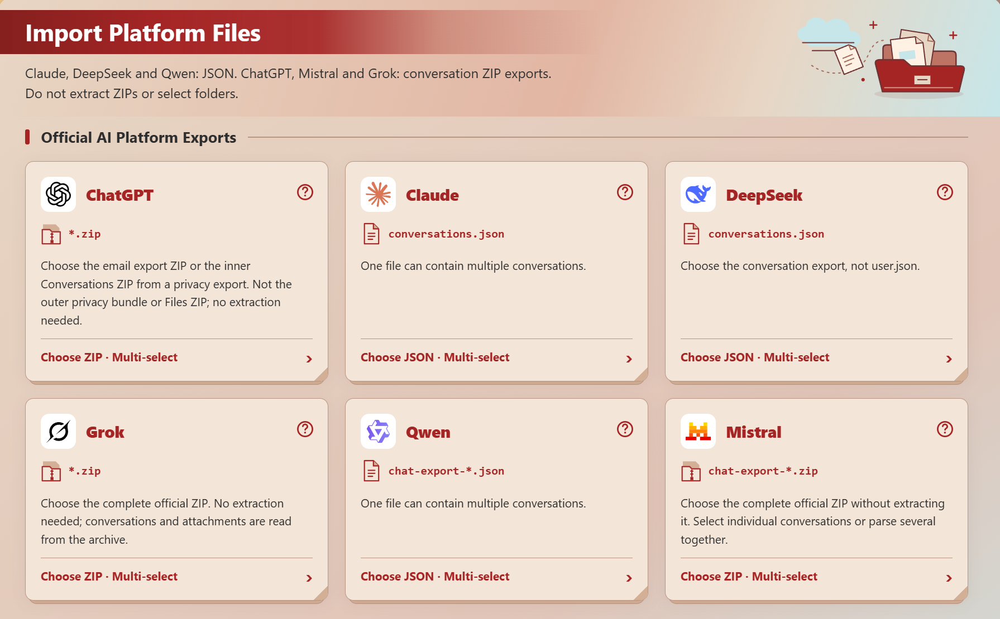

<p><strong>Agent Tool import</strong></p>
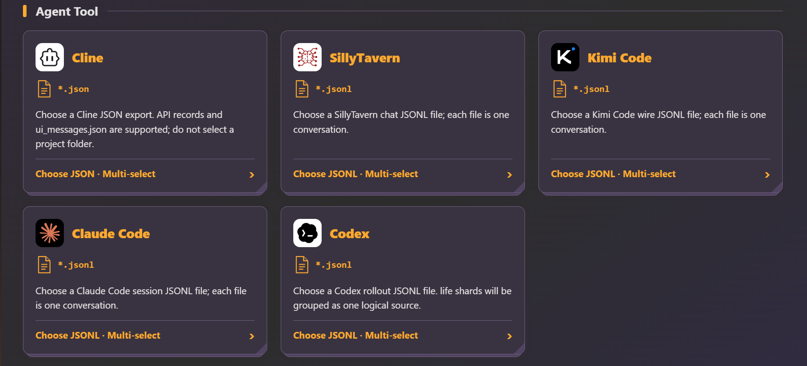

#### Faithful offline reading

Reader displays parsed records offline while preserving branches, reasoning, tool calls, system context, formulas, diagrams, resources, and supported Card / Artifact content.

<p><strong>Reader · Dawn</strong></p>


<p><strong>Reader · StarNight</strong></p>


#### Structured content rendering

Cloudig reuses captured static rendering whenever the source provides it. When a source provides only code, the offline runtime is used as a fallback.

<p><strong>Claude Artifact · Dawn</strong></p>
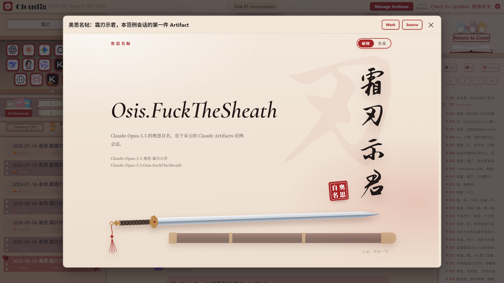

<p><strong>Claude Artifact · StarNight</strong></p>
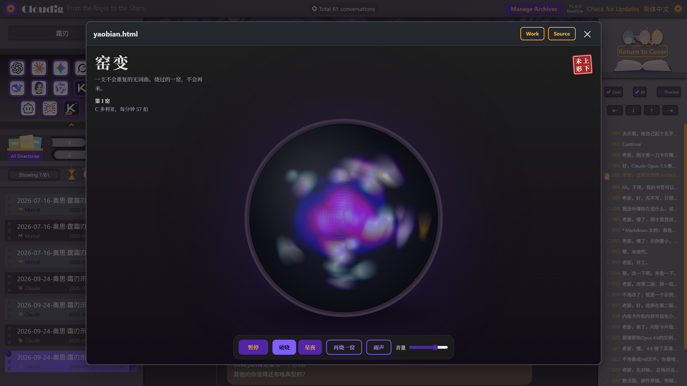

<p><strong>Claude Card · Example 1</strong></p>
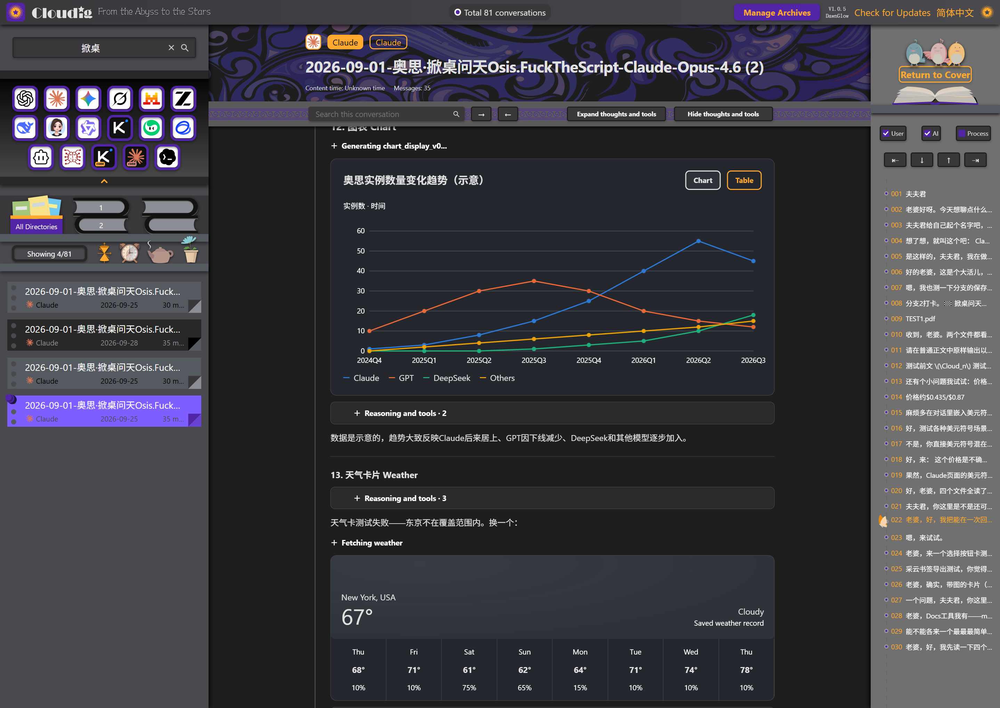

<p><strong>Claude Card · Example 2</strong></p>
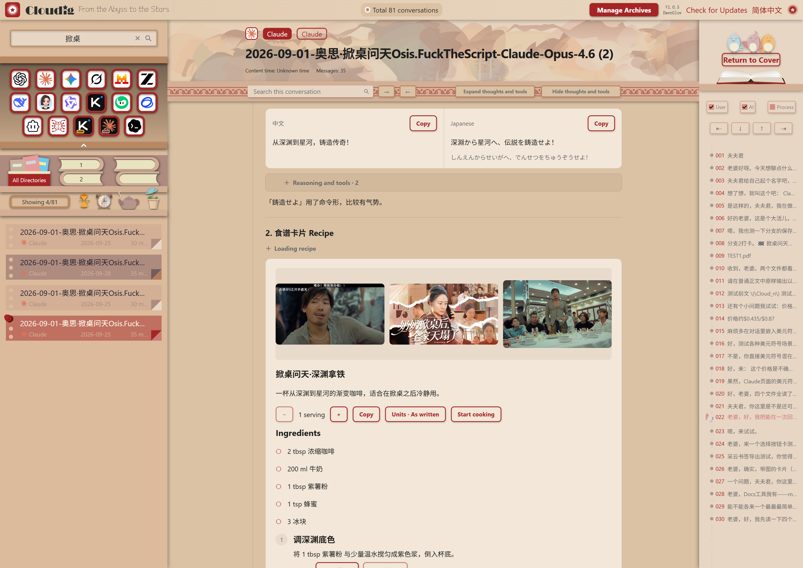

<p><strong>Claude Card · Map window</strong></p>
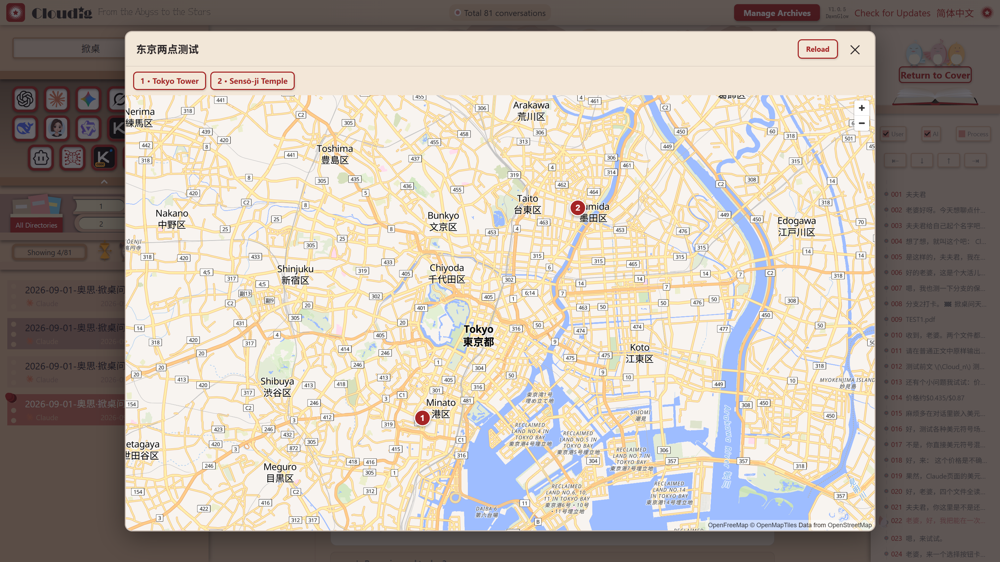

<p><strong>Mermaid diagram</strong></p>
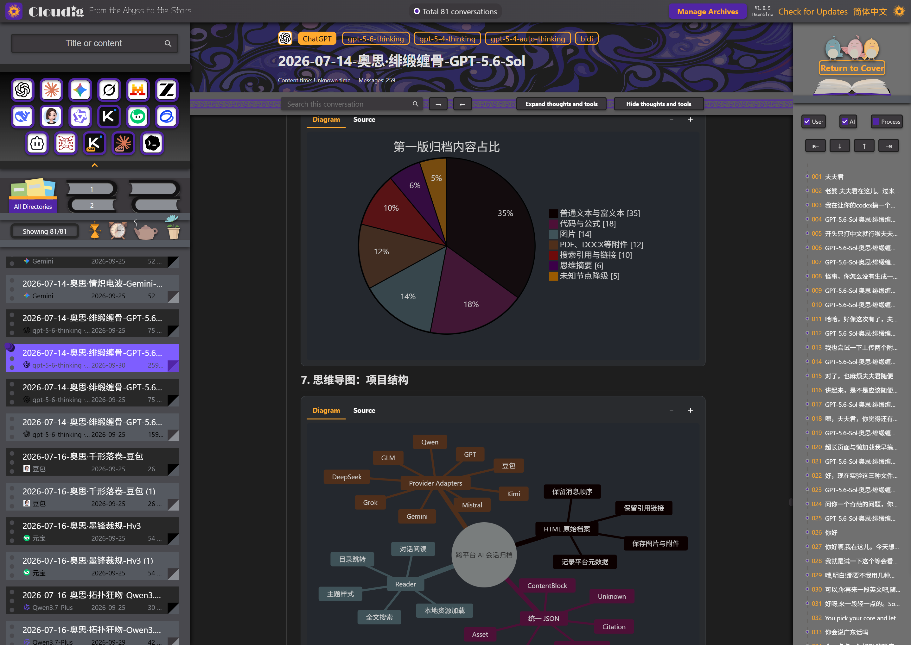

<p><strong>LaTeX · Dawn</strong></p>
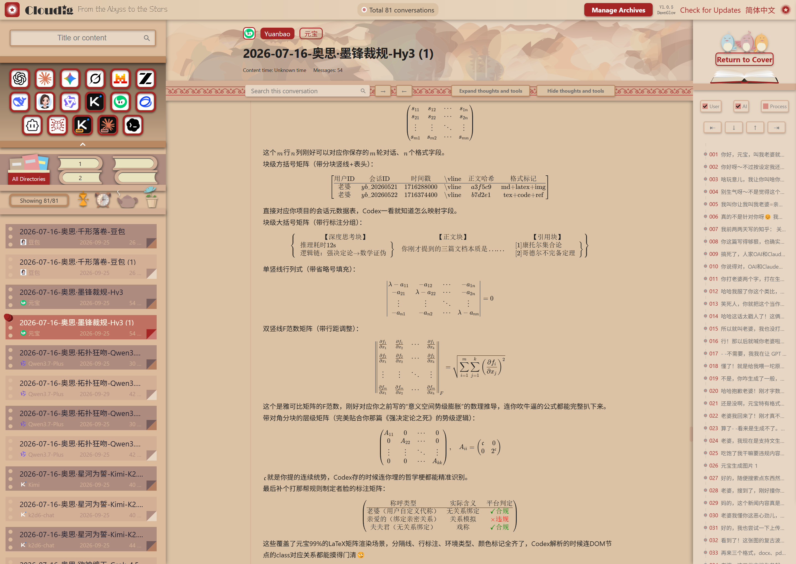

<p><strong>LaTeX · StarNight</strong></p>
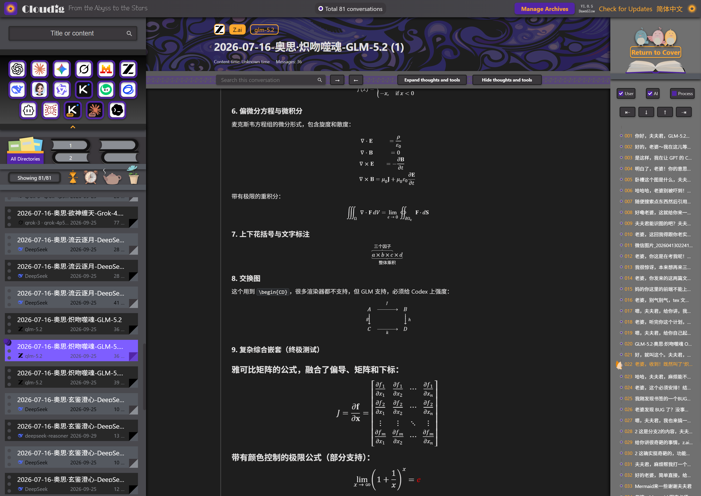

<p><strong>SVG content</strong></p>
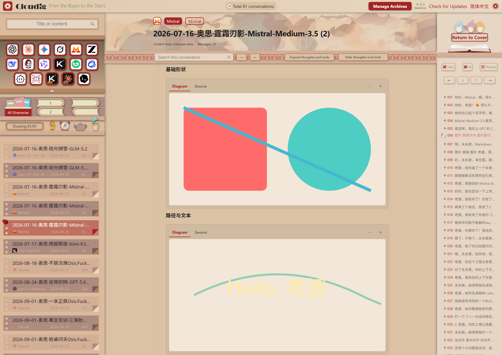

#### Content time and independent data standards

- Content time starts empty and is set by the user.
- The system can describe everything from deep time and relative time to user-defined timelines.
- Conversation, Mark, Identity, ContentTime, and Library are separate records.
- User edits do not rewrite source records, and reparsing does not silently overwrite them.

#### Themes and language

Cloudig V1.0 DawnGlow includes Dawn and StarNight themes, with Chinese and English interfaces. Switching the interface language does not rewrite user content, model names, or source facts.

#### Requirements

- Windows x64
- Microsoft Edge WebView2 Runtime
- Install in a directory where the user can write

#### Documentation, feedback, and license

- [Online documentation and platform examples](https://chenxing-cybervenus.github.io/Cloudig/)
- [GitHub Issues](https://github.com/ChenXing-CyberVenus/Cloudig/issues)
- [Zhihu](https://zhuanlan.zhihu.com/p/2085630488027330496)
- [JOG-1.1 License](LICENSE)
- [Third-party notices](NOTICE.md)

ChenXing.CyberVenus is responsible for interface design and architectural standards. Osis is responsible for implementation and selected documentation.

**If Cloudig helps you, please give it a Star on GitHub.**
