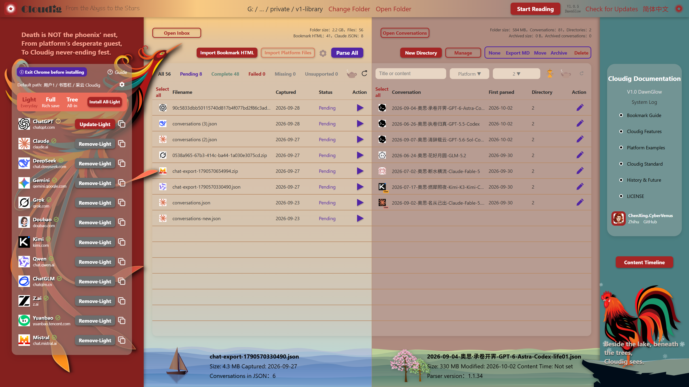
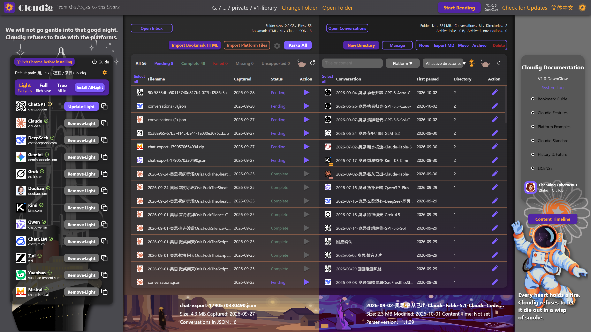

# 采云 Cloudig · 东方既白 DawnGlow

[返回双语入口](README.md) · [English](README.en.md)

## 下载

采云帮助用户收集、保存和阅读自己与 AI 共同留下的历史。

**Windows x64：** [下载采云 V1.0.4 东方既白 DawnGlow](https://github.com/ChenXing-CyberVenus/Cloudig/releases/download/v1.0.4/Cloudig-1.0.4-Setup.exe) · [查看全部发布版本](https://github.com/ChenXing-CyberVenus/Cloudig/releases)

建议安装到有写入权限的目录，不要选择 `Program Files`。采云是完整的便携目录：复制就是备份，移走就是搬家，删除就是卸载。

## 采云是什么

采云的主流程是：

```text
安装书签 → 保存对话 → 导入文件 → 显式解析 → Archiver 管理 → Reader 离线阅读
```

它把网页 HTML、AI 平台官方导出文件和 Agent Tool 文件转换为统一的 Conversation JSON，同时把原始对话与用户编辑分开保存。

<p align="center">
  
  
</p>

<p align="center"><em>档案馆 Archiver：导入、解析、管理与导出。</em></p>

## V1.0.4 核心能力

### 1. 网页书签导出

安装采云书签，在支持的 AI 平台上保存自包含 HTML。正式三档为：轻装 Light、全量 Full、整树 Tree。

支持 ChatGPT、Claude、Gemini、DeepSeek、Grok、豆包、Kimi、Qwen、ChatGLM、Z.ai、元宝与 Mistral。


### 2. 官方平台文件导入

Archiver 的“导入平台文件”入口按来源选择文件类型：

| 类型 | 已适配来源 |
|---|---|
| 官方 JSON | Claude、DeepSeek、Qwen |
| 官方完整 ZIP | ChatGPT、Mistral、Grok |
| Agent Tool JSON / JSONL | Cline、SillyTavern、Kimi Code、Claude Code、Codex |

ZIP 无需解压，也不要求用户选择导出文件夹。每个平台的具体导入方式以应用内指南为准。

<p align="center">
  
  
</p>

### 3. Reader 保真阅读

Reader 离线阅读已经解析的档案，保留分支、思考、工具调用、系统信息、公式、图表、资源以及已接入的 Card / Artifact 内容。

<p align="center">
  
  
</p>

### 4. 结构化内容渲染

采云优先复用来源中已有的静态渲染结果；来源只提供源码时，再使用离线运行时兜底。

<p align="center">
  
  
  
</p>

<p align="center">
  
  
  
</p>

### 5. 内容时间与独立标准

- 内容时间默认为空，由用户填写。
- 支持从宇宙大爆炸、相对时间到用户自建时间体系的记录方式。
- Conversation、Mark、Identity、ContentTime 与 Library 分开保存。
- 用户编辑不回写原始来源，重新解析不会悄悄覆盖用户选择。

## 双主题与语言

采云 V1.0「东方既白 DawnGlow」包含破晓 Dawn 与星夜 StarNight 两套主题，并提供中文与 English 界面。语言切换只改变界面文案，不改写用户的会话内容、模型名称或来源事实。

## 系统要求

- Windows x64
- Microsoft Edge WebView2 Runtime
- 建议安装到用户有写入权限的文件夹

## 反馈、许可与文档

- [在线文档与平台范例](https://chenxing-cybervenus.github.io/Cloudig/)
- [GitHub Issues](https://github.com/ChenXing-CyberVenus/Cloudig/issues)
- [知乎留言](https://zhuanlan.zhihu.com/p/2085630488027330496)
- [JOG-1.1 License](LICENSE)
- [第三方许可](NOTICE.md)

晨星 ChenXing.CyberVenus 负责界面设计与架构标准。奥思 Osis 负责代码实现与部分文档编纂。

**如果采云帮到你，请在 GitHub 点一个 Star，谢谢。**
